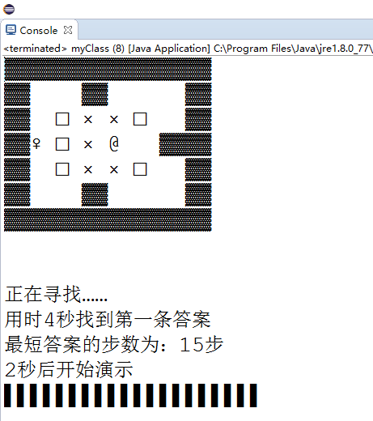
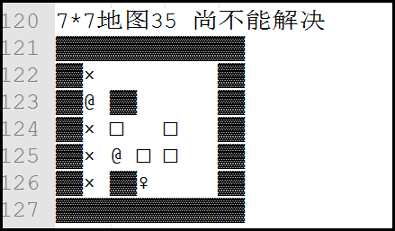

#推箱子最佳答案

##这段代码可以做什么？

对于地图较小的推箱子游戏，这段代码可以轻易找到最佳路径！

#如何用？

先找到要求解的推箱子地图，把Constant.N设置为地图边长+2，再在Constant按照示例填写地图（0表示空 1表示箱子 ……），之后运行即可。

#最短“路径”
本程序找到的是最少推动次数的答案，若希望的到最少移动次数的答案，只需要对key[][][]进行进一步的处理，再比较即可得到。

#关于这段代码？

大神问我用的什么搜索？

我没学过算法之类的，不明白他在问什么。

起个名字的话，就叫“多重影分身之术”好了，因为每走一步主人公“♀”就会发动“多重影分身之术”，影分身将填满所能达到的所有区域。

原本的想法是打算从完成时的情形出发，进行逆推，和现在的正推结合，如此以来可以减去大量的运算，不过作者属于业余中的业余，似乎自己的程序能够（用时4秒）求解这张经典的地图（上图）已经比较满意，因此把这个想法实现出来大概是很久以后了，另外这个方法已经在两年前写的可用来“还原某个状态魔方的最短路径”的小程序中使用过，也不算是新想法。

之前的版本也添加过“记忆”：将所有走过的死胡同都记录下来，当再次走到相同情形时，就放弃这种推法，不过现在的版本不用记忆也能轻易解决简单的地图了，因此也就没再加上“记忆”。

现在这段代码还十分粗糙，比如下面这个地图似乎就没算出来，不过就先这样吧。

		String str=""	
				+ "44444445"
				+ "43000045"
				+ "46400045"
				+ "43101045"
				+ "43611045"
				+ "43420045"
				+ "44444445"
				+ "55555555";

