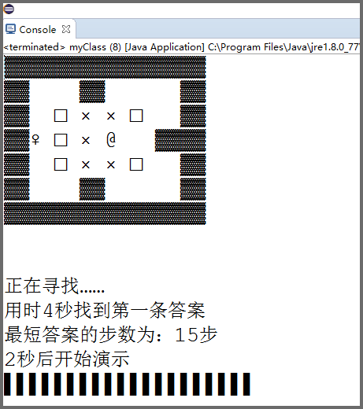

#推箱子最佳答案

##这段代码可以做什么？

对于地图较小的推箱子游戏，这段代码可以轻易找到最佳路径！

#如何用？

先找到要求解的推箱子地图，把Constant.N设置为地图边长+2，再在Constant按照示例填写地图（0表示空 1表示箱子 ……），之后运行即可。

#关于这段代码？

大神问我用的什么搜索？

我没学过算法之类的，根本不明白他在问什么。

原本的想法是打算从完成时的情形出发，进行逆推，和现在的正推结合，如此以来可以减去大量的运算，不过作者属于业余中的业余，似乎自己的程序能够（用时4秒）求解这张经典的地图（上图）已经比较满意了，因此把这个想法实现出来大概是很久以后了（并不知道这算不算一个什么算法），另外这个方法已经在两年前写的可用来“还原某个状态魔方的最短路径”的小程序中使用过，也不算是新想法。

